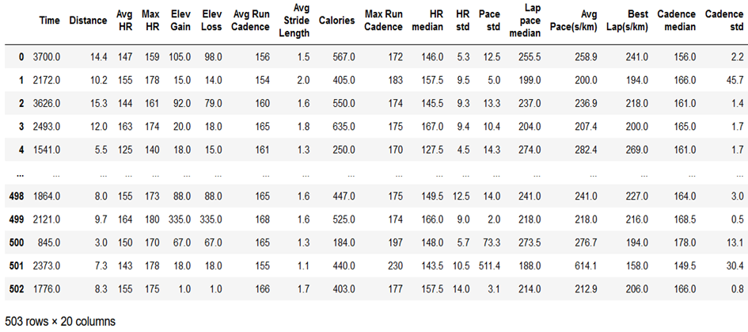
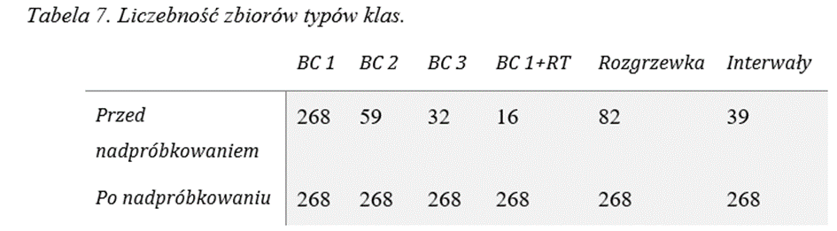
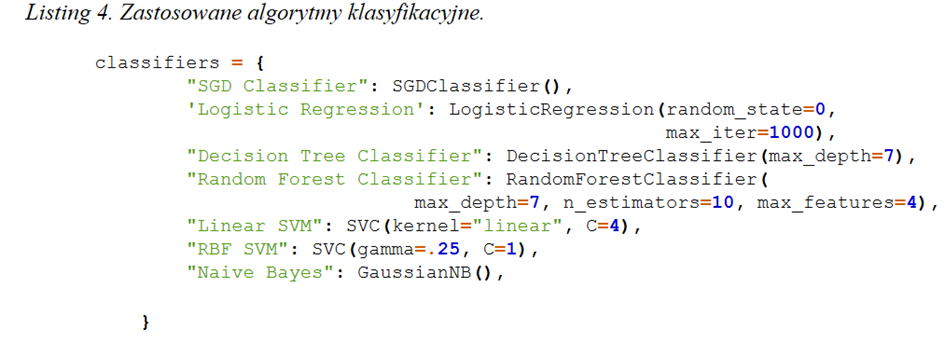
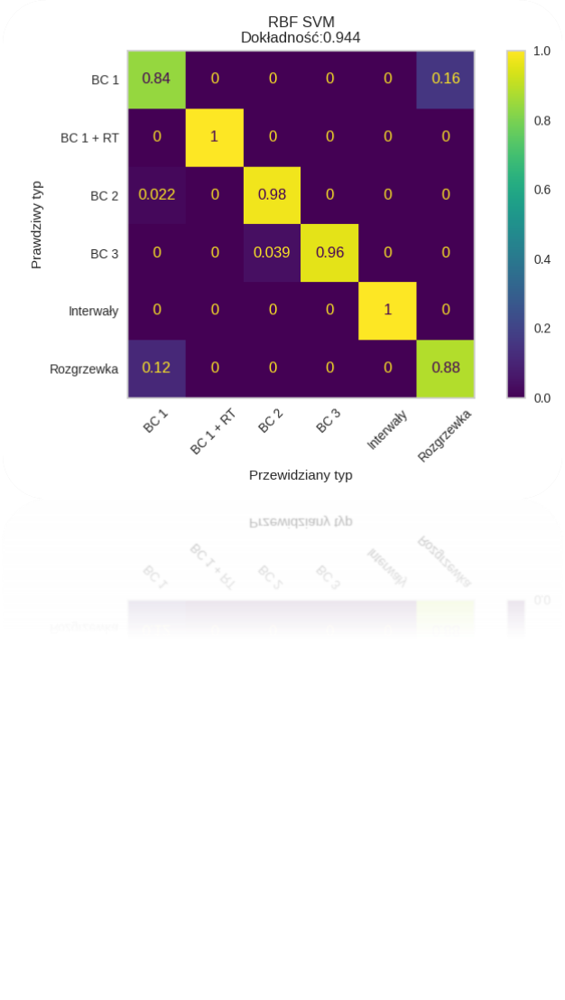
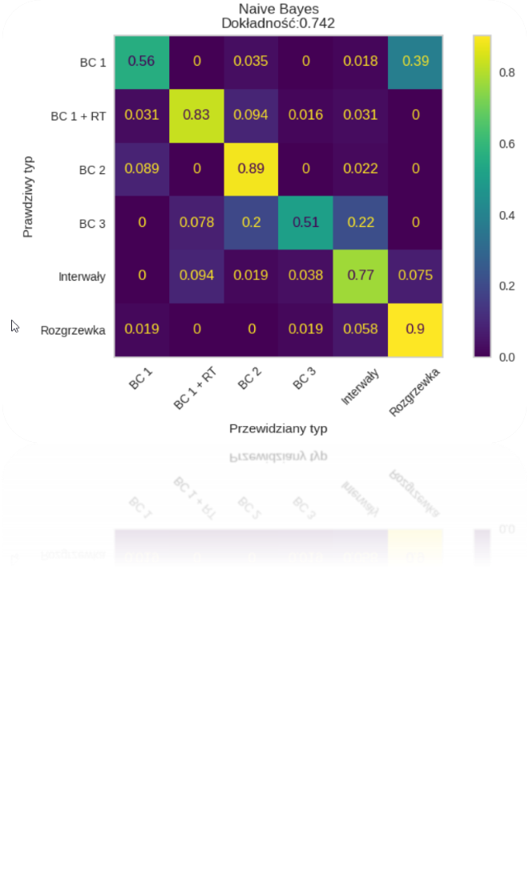
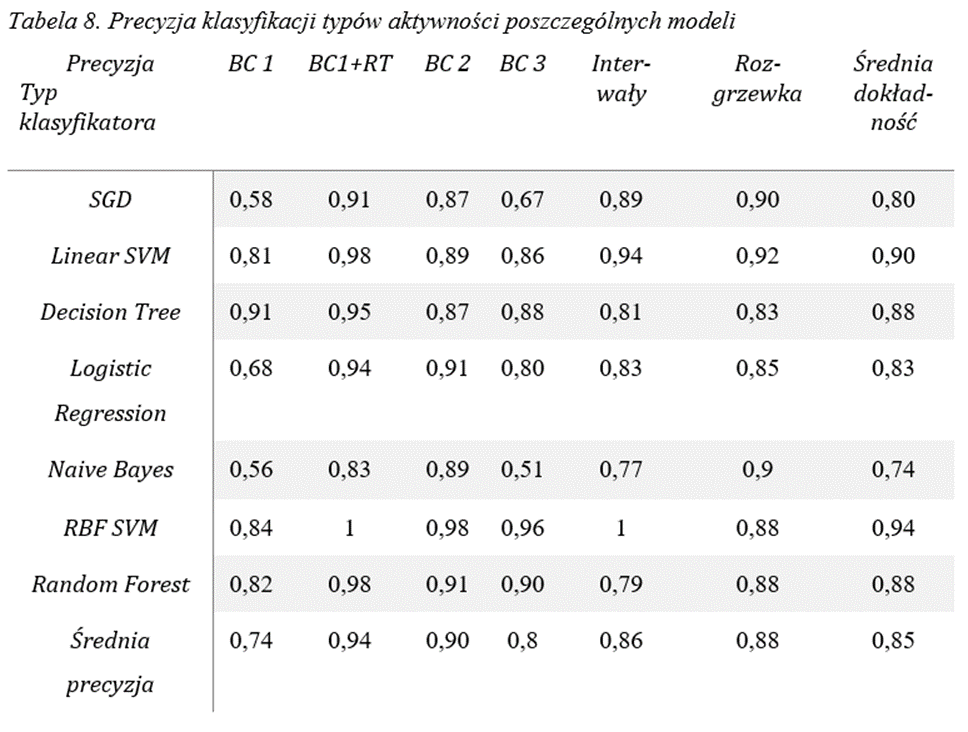

#Garmin Trening Clasificator

##Wstęp
Ruch. Słowo te można by uznać za synonim słowa “Życie”. Od jego początku aż do końca, my bądź nasz organizm pozostaje w ruchu. Rodzimy się, zaczynamy raczkować, później chodzić. A w momencie, kiedy chcemy szybciej to biegam. Wraz z rozwojem technologii, zaczęliśmy wykorzystywać jej zdobycze. Dotychczas do analizy danych biometrycznych wykorzystywało się metody staty-styczne oraz polegało się na intuicji trenerów. Wykorzystanie metod sztucznej inteligencji bę-dzie kolejnym krokiem w konkurowaniu oraz uzyskiwaniu lepszych wyników

##Cel
W tej pracy skupiono uwagę na stworzeniu narzędzi do analizy biometrycznych danych treningowych możliwych do zebrania za pomocą urządzeń typu wearable sensors. W ten spo sób powstało sześć klasyfikatorów jednostek treningowych ze względu na ich typ. 
##Zbiór danych
Dane zostały zebrane za pomocą urządzenia Garmin Fenix 5 Plus oraz Polar H10. Następnie za pomocą skrapera, zostały pobrane z serwisu Garmin Connect. W taki sposób zostało pobrane łącznie ponad 500 zapisów treningów. Kolejnym etapem było przekształcenie, czyszczenie oraz przygotowanie danych. W wyniki tych operacji powstał zbiór danych z ponad 500 elementami. 

Dane zostały w ręczny sposób po etykietowane z względu na rodzaj treningu.

## Klasyfikacja
Następnie stworzone zostały następujące klasyfikatory

##Ewaluacja
W celu ewaluacji modeli, wykorzystałem metrykę dokładności, precyzji oraz macierz zamieszania.

Poniżej znajdują się wyniki, najlepszego oraz najgorszego modelu.

RBF SVM         |  Naive Bayas
:-------------------------:|:-------------------------:
 | 

Poniżej zaprezentowana jest tabela podsumowująca wyniki modelów.

Najlepsze wyniki uzyskał model na podstawie algorytmu RBF SVM. Jest to algorytmSVM, wykorzystanym jądrem radial basis function. Dokładność tego modelu wyniosła 94%. Jako jedyny model uzyskał wynik na poziomie 100% klasach BC 1 + RT oraz interwały. Naj-niższą dokładność uzyskał model na podstawie algorytmu Naive Bayas.  Najtrudniejszym  do sklasyfikowania okazała się aktywność typu BC 1 oraz BC 3. Ciekawym wynikiem okazała się precyzja klasyfikacji klasy rozgrzewki. Model ten uzyskał drugi najwyższy wynik w tej klasie. Model SVM z jądrem liniowym uzyskał drugi najwyższy wynik. Ponownie model oparty na 52:8354735347
53SVM najwyższą precyzje uzyskiwał w klasach BC1 + RT oraz interwały. Zauważalny jest pro-blem znacznie niższej precyzji klasyfikacji klasy BC 1. Jest to klasa najliczniejsza, która nie została  poddana  nadpróbkowaniu.  Średnia  precyzja  wprezentowanych  modelach  wyniosła 0,74, standardowe odchylenie wyniosło 0,12, z minimalną precyzją 0,56 maksimum 0,91

##Podsumowanie
Przeprowadzone badanie udowodniło, że jest możliwe stworzenie modelu klasyfikacyj-nego jednostek treningowych z względu na ich typ za pomocą metod uczenia maszynowego oraz biometrycznych danych treningowych. Najlepsze wyniki osiągnął model na podstawie al-gorytmu maszyny wektorów nośnych z radialną funkcją jądra